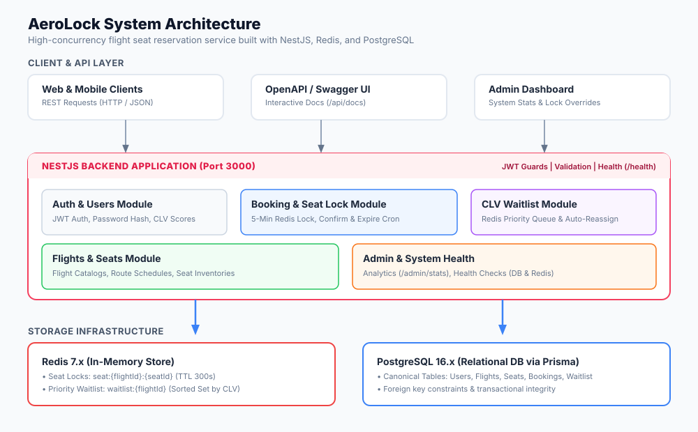
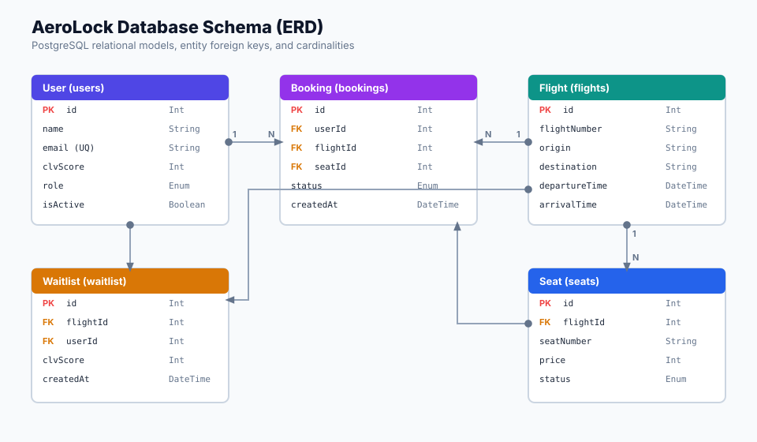

# AeroLock

AeroLock is a backend service for managing flight reservations under high concurrent traffic. It prevents double booking using Redis-based seat locking, manages temporary reservation holds, and automatically prioritizes waitlisted passengers using Customer Lifetime Value (CLV). Built with NestJS, PostgreSQL, Prisma, and Redis, it demonstrates practical backend engineering patterns for consistency, concurrency control, and modular system design.

---

## Problem Statement

High-concurrency reservation systems face critical data integrity and transaction throughput challenges during high-volume booking events:

* **Race Conditions & Double-Booking:** When multiple clients attempt to reserve the same seat concurrently, standard database read-then-write patterns introduce race conditions. Unprotected concurrent writes allow overlapping transactions to confirm the same seat ID, resulting in double-booking errors.
* **Database Lock Contention:** Relying on relational database row locks (`SELECT ... FOR UPDATE`) under high concurrent traffic leads to transaction contention, query timeouts, and database connection pool exhaustion.
* **Temporary Seat Locking & TTL Expiration:** Passengers require a temporary reservation window to complete checkout. Holding inventory indefinitely blocks seat availability, while failing to release unpaid holds promptly leads to stale inventory lockouts. The backend must enforce deterministic Time-To-Live (TTL) mechanisms for temporary seat locks.
* **Waitlist Prioritization:** Standard First-In, First-Out (FIFO) queues treat all waitlisted passengers equally, ignoring customer tier status and business value. Reassigning canceled or expired seats requires a deterministic prioritization engine capable of evaluating customer lifetime value alongside timestamp offsets.

---

## Key Features

### Redis-Based Seat Locking
* **What it does:** Uses atomic Redis locks with a configurable TTL to temporarily reserve seats during checkout.
* **Why it exists:** Offloads concurrency control from PostgreSQL to in-memory execution, eliminating database row lock contention and preventing double-booking during simultaneous reservation attempts.

### CLV-Driven Waitlist Prioritization
* **What it does:** Queues waitlisted passengers using Redis Sorted Sets, calculating priority scores based on Customer Lifetime Value (CLV) combined with arrival timestamps for tie-breaking.
* **Why it exists:** Ensures high-value passengers receive priority seat reallocation whenever inventory expires or bookings are canceled, replacing unprioritized FIFO queues.

### Automated Inventory Cleanup & Reassignment
* **What it does:** Runs periodic background cron tasks (`@nestjs/schedule`) to query for expired pending bookings, clear stale Redis locks, and trigger waitlist promotion.
* **Why it exists:** Reclaims unpaid seat holds and reallocates inventory automatically without requiring manual administrator intervention or client-side polling.

### Stateless Authentication & Role-Based Access Control
* **What it does:** Issues signed JSON Web Tokens (JWT) upon login and enforces access restrictions using NestJS guards and `@Roles()` metadata decorators.
* **Why it exists:** Secures administrative endpoints (such as flight creation and lock overrides) while keeping passenger request authentication stateless.

### Relational Persistence & Schema Integrity
* **What it does:** Persists canonical entities (`User`, `Flight`, `Seat`, `Booking`, `Waitlist`) using Prisma ORM over PostgreSQL.
* **Why it exists:** Guarantees strict relational data integrity, foreign key constraints, and type-safe query execution for all persistent domain models.

### Dynamic OpenAPI / Swagger Discovery
* **What it does:** Generates interactive API documentation at `/api/docs` from NestJS controllers and DTO validation schemas.
* **Why it exists:** Provides dynamic contract inspection, schema verification, and endpoint testing capabilities directly from the application runtime.

---

## Technology Stack

| Technology | Purpose |
| --- | --- |
| NestJS | Backend framework |
| TypeScript | Type safety |
| PostgreSQL | Persistent data storage |
| Redis | Seat locking and waitlists |
| Prisma ORM | Database access and migrations |
| JWT | Authentication |
| Swagger | API documentation |
| Docker Compose | Local PostgreSQL and Redis services |

---

## System Architecture



AeroLock is designed as a modular backend monolith where distinct business capabilities—such as authentication, flight scheduling, seat reservations, and waitlist management—are encapsulated into independent NestJS domain modules. The service layer orchestrates dual-persistence operations, directing short-lived concurrency locks to Redis and permanent transactional state to PostgreSQL via Prisma ORM.

---

## Database Schema



The database schema models core flight reservation relationships through five primary entities: `User`, `Flight`, `Seat`, `Booking`, and `Waitlist`. Foreign key constraints enforce relational integrity across user accounts, scheduled flights, assignable seats, and active booking or waitlist records.

---

## Project Structure

```text
src/
├── admin/          # Administrative flight overrides and system management endpoints
├── auth/           # Authentication strategies, JWT guards, and login controllers
├── bookings/       # Reservation handling, Redis lock acquisition, and cleanup jobs
├── common/         # Shared exception filters, decorators, and global guards
├── config/         # Environment variable schemas and configuration loaders
├── flights/        # Flight catalog management, route scheduling, and seat queries
├── infrastructure/ # Database connection modules for Prisma ORM and Redis clients
├── notifications/  # Event notification handlers for booking state changes
├── users/          # User profile persistence, password hashing, and role claims
└── waitlist/       # Priority waitlist engine utilizing Redis Sorted Sets
```

---

## Booking Lifecycle

1. **Reservation Request:** The client submits a reservation payload containing `flightId` and `seatId`.
2. **Atomic Lock Attempt:** The backend executes `SET seat:lock:{flightId}:{seatId} {userId} NX PX 600000` in Redis. If key creation fails, the endpoint returns a `409 Conflict` response.
3. **Pending Record Creation:** Upon acquiring the Redis lock, the backend creates a `PENDING` booking record in PostgreSQL tied to a 10-minute hold window.
4. **Payment Processing:** The client submits payment details before the 10-minute reservation TTL expires.
5. **Confirmation & Persistence:** On payment confirmation, the booking status updates to `CONFIRMED` in PostgreSQL and the seat state updates to `BOOKED`.
6. **Expiration & Inventory Release:** If payment is not completed before TTL expiration, a scheduled background job removes the Redis lock, marks the booking as `EXPIRED`, and releases the seat.

---

## Waitlist Engine

When a flight is fully booked, passengers can submit a request to join a priority waitlist managed within Redis Sorted Sets:

* **Score Ranking:** Passengers are ranked in the waitlist using composite scores derived from Customer Lifetime Value (CLV) and request arrival timestamps.
* **Deterministic Priority:** Passengers with higher CLV scores are placed near the top of the queue. Equal CLV scores are broken deterministically by favoring earlier join timestamps.
* **Automated Promotion:** When a seat becomes available, the highest-priority passenger is automatically promoted from the waitlist and a new pending reservation is initiated.

---

## Authentication & Authorization

* **JSON Web Tokens (JWT):** Authenticated users receive a signed JWT payload containing user identity claims (`userId`, `email`, `role`) for stateless authentication.
* **Protected Routes:** Endpoints requiring identity verification enforce NestJS `JwtAuthGuard` instances to validate Bearer tokens on incoming headers.
* **Role-Based Access Control (RBAC):** Privileged actions (such as flight management and lock overrides) are restricted to administrative accounts using a custom `RolesGuard` and `@Roles(Role.ADMIN)` metadata annotations.

---

## API Documentation

Interactive OpenAPI documentation is generated using NestJS Swagger annotations. When running the server locally, full endpoint contracts, DTO schema definitions, and JWT authentication testing are accessible via Swagger UI at:

`http://localhost:3000/api/docs`

---

## Running Locally

> **Note on Infrastructure:** Docker Compose is used exclusively to provision local PostgreSQL and Redis database instances. The NestJS backend application runs directly on Node.js and is not containerized.

### Prerequisites

* **Node.js** (v18+)
* **npm** (v9+)
* **Docker Desktop** (for local PostgreSQL and Redis containers)

### Setup & Run Instructions

```bash
# 1. Clone the repository
git clone https://github.com/tianshen3/AeroLock_Server.git
cd AeroLock_Server

# 2. Install dependencies
npm install

# 3. Configure environment variables
cp .env.example .env

# 4. Start database infrastructure (PostgreSQL & Redis)
docker compose up -d

# 5. Generate Prisma client, run migrations, and seed initial data
npm run prisma:generate
npm run prisma:migrate
npm run prisma:seed

# 6. Start NestJS development server
npm run start:dev
```

The application server listens on `http://localhost:3000/api`. Interactive Swagger documentation is available at `http://localhost:3000/api/docs`.

---

## Future Improvements

* **Payment Gateway Integration:** Connect a sandbox payment provider (such as Stripe) to process reservation payments before converting pending holds into confirmed bookings.
* **Read Caching Layer:** Implement Redis caching for high-frequency flight search endpoints to reduce read pressure on PostgreSQL.
* **Observability & Telemetry:** Instrument Prometheus metrics collection and Grafana dashboards for monitoring seat lock hit rates, key expirations, and queue latencies.
* **Real-Time Notification Delivery:** Introduce WebSocket connections to dispatch immediate waitlist promotion and hold expiration alerts to connected clients.
* **Automated Test Coverage Expansion:** Extend end-to-end and concurrent load testing suites to validate lock acquisition under artificial race conditions.

---

## License

This project is licensed under the [MIT License](LICENSE).
